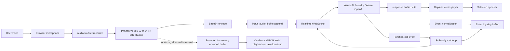

# Architecture

Realtime Audio Studio is a static Vue 3 + TypeScript + Vite PWA. It has no backend and no router. The browser owns microphone capture, WebSocket transport, realtime session configuration, playback, preferences, and event logging.

## Layers

### Models and catalog

The model catalog defines capability profiles for each preset. Those profiles drive:

- Which session parameters the UI renders.
- Which realtime provider features are enabled.
- Whether the model uses the GA nested session schema or the legacy flat schema.

GA presets include `gpt-realtime`, `gpt-realtime-1.5`, `gpt-realtime-2`, and `gpt-realtime-mini`. The legacy preset is `gpt-4o-realtime-preview`.

### Providers

Provider modules build endpoint-specific realtime URLs and capability metadata.

- Azure AI Foundry: full realtime audio.
- Azure OpenAI: full realtime audio.
- GitHub Models: REST inference only; realtime controls are gated/disabled.

Browser WebSocket authentication uses the `api-key` query parameter because browsers cannot set custom WebSocket headers.

### Realtime engine

The realtime engine owns:

- WebSocket lifecycle.
- Session creation and update events.
- Initial configuration after `session.created` and debounced live updates when settings or tools change.
- Mapping UI session configuration into GA nested or legacy flat schemas.
- Event normalization for display.
- Audio append and response-control messages.
- Stub function-call loop handling.

The event normalizer tolerates realtime audio-event name differences across preview and GA endpoints so logging remains useful as endpoint payloads evolve.

### Audio engine

The audio layer captures mono microphone input and encodes preallocated 100 ms chunks in an AudioWorklet. PCM16 uses 24 kHz; optional G.711 mu-law and A-law use 8 kHz browser resampling and one-byte companding for telephony accuracy tests. A streaming worklet resampler covers browsers that cannot create a native 8 kHz audio context. The main thread base64-encodes the transferred chunks for WebSocket append events and plays PCM16 model output through a gapless player. An opt-in rolling buffer can retain transferred encoded chunks after the realtime callback runs; it adds no per-chunk copy, stays bounded to five minutes, and only decodes or concatenates data when the user requests playback or download. Chromium browsers provide the best output-device selection support through `setSinkId`.

### Pinia stores

Pinia stores are the integration hub:

- `settings`: provider/model preferences, session parameters, theme, and in-memory endpoint/deployment/API-key values.
- `connection`: WebSocket status and lifecycle state.
- `eventlog`: ring buffer for socket events, normalized events, redacted URLs, and tool-call messages.
- `tools`: user-defined stub-only tool definitions.
- `audioDevices`: microphone and speaker device lists and selections.

Secrets remain in memory only. Non-secret preferences may be saved to `localStorage`.

### UI

The single-page UI coordinates setup, parameter editing, microphone permissions, speaker selection, connection control, realtime conversation state, event inspection, and stub tool definition.

## Data flow

## Session schemas

GA realtime models use a nested session schema. Legacy preview models use a flat schema. The model capability profile selects the mapper so the UI can expose parameters consistently without forcing one schema onto all deployments.

## Security boundaries

The app is intentionally static. It does not proxy requests, execute tool code, call external MCP servers, or store API keys. The only secret-bearing network path is the user-initiated `wss` connection to the configured Azure endpoint.
